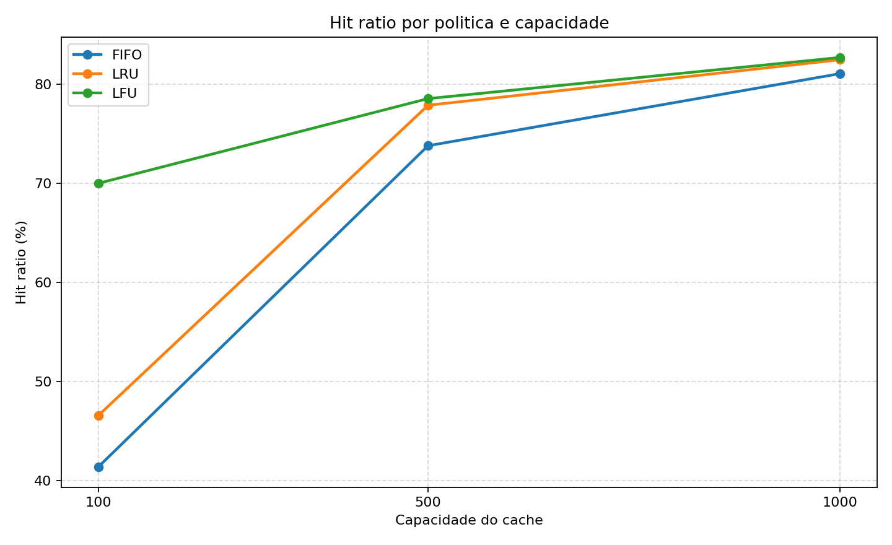

# CacheLab · Simulador de memória cache

**Como a política de substituição e a capacidade de um cache influenciam sua taxa de acertos?** O CacheLab transforma essa pergunta em um experimento reproduzível: lê uma sequência de acessos, compara FIFO, LRU e LFU e gera resultados em CSV, gráfico e relatório PDF.

Projeto acadêmico desenvolvido em Python, com execução por linha de comando e testes automatizados. Entrega original: **30 de junho de 2026**.



[Relatório experimental](docs/relatorio-experimental.pdf) · [Resultados em CSV](results/experiment_results.csv) · [Implementação das políticas](cache/policies.py)

## O que o projeto faz

- Simula acessos a um cache com capacidade configurável, medida em quantidade de itens.
- Compara três políticas sob o mesmo conjunto de acessos.
- Calcula total de acessos, acertos (*hits*), falhas (*misses*) e taxa de acertos (*hit ratio*).
- Gera sequências sintéticas de acesso com semente configurável.
- Automatiza experimentos em diferentes capacidades e exporta tabelas, gráfico e PDF.

## Políticas implementadas

| Política | Critério de substituição | Implementação |
| --- | --- | --- |
| **FIFO** — First In, First Out | Remove o item inserido há mais tempo. Um acerto não altera sua posição. | Fila (`deque`) e conjunto (`set`). |
| **LRU** — Least Recently Used | Remove o item acessado há mais tempo. Cada acerto atualiza a recência. | `OrderedDict`. |
| **LFU** — Least Frequently Used | Remove o item com menor frequência de acesso; empates são resolvidos pela inserção mais antiga. | Dicionários de frequência e ordem de inserção. |

Na LFU, a frequência é mantida enquanto o item permanece no cache. Caso ele seja removido e retorne, sua contagem começa novamente.

## Tecnologias e organização

**Python 3** implementa o simulador e a CLI com `argparse`; **Matplotlib** gera o gráfico, **ReportLab** monta o PDF e **pytest** cobre os testes. As dependências estão em [`requirements.txt`](requirements.txt).

```text
cache_simulator.py          # Entrada da CLI
cache/
  policies.py              # FIFO, LRU, LFU e seleção da política
  simulator.py             # Leitura do CSV e cálculo das métricas
scripts/
  generate_trace.py        # Geração do trace sintético
  run_experiments.py       # Matriz de experimentos, CSV e gráfico
  generate_report.py       # Relatório experimental em PDF
data/trace.csv             # Trace incluído: 10.000 acessos
results/                   # Resultados e gráfico do experimento
docs/                      # Relatório e imagem de apresentação
tests/                     # Testes das políticas, CLI e geração de arquivos
```

## Executar localmente

Tenha Python 3 e Git instalados. Execute os comandos a partir da raiz do repositório.

```bash
git clone https://github.com/figueirego/cachelab-simulador-de-memoria-cache.git
cd cachelab-simulador-de-memoria-cache
python3 -m venv .venv
source .venv/bin/activate
python -m pip install -r requirements.txt
```

No Windows, crie o ambiente com `py -m venv .venv` e ative-o no PowerShell com `.venv\Scripts\Activate.ps1`.

### Simular uma política

O trace incluído permite executar o projeto sem gerar dados novos:

```bash
python cache_simulator.py --input data/trace.csv --policy lru --capacity 100
```

Os valores aceitos em `--policy` são `fifo`, `lru` e `lfu`. A capacidade deve ser um inteiro positivo.

Saída correspondente ao trace versionado:

```text
Policy: lru
Capacity: 100
Total accesses: 10000
Hits: 4659
Misses: 5341
Hit ratio: 46.59%
```

### Comparar políticas e gerar o relatório

```bash
python scripts/run_experiments.py --input data/trace.csv
python scripts/generate_report.py
```

Por padrão, os experimentos executam as três políticas nas capacidades **100, 500 e 1.000**, gerando `results/experiment_results.csv` e `results/hit_ratio_by_policy.png`. O segundo comando usa esses arquivos para gerar `docs/relatorio-experimental.pdf`.

Para outras capacidades, use `--capacities 50 200 800` no comando de experimentos. Os caminhos de saída também são configuráveis; consulte `--help` em cada script.

### Usar seus próprios dados

O CSV deve ter uma coluna `item_id`. Cada valor não vazio representa um acesso; linhas com identificador vazio são ignoradas. O arquivo precisa conter ao menos um acesso válido.

```csv
item_id
10
15
10
20
```

Para gerar um trace sintético separado:

```bash
python scripts/generate_trace.py --output data/trace-custom.csv --rows 10000 --seed 42
```

O gerador cria um padrão não uniforme de itens quentes, mornos e frios, com repetições periódicas. A CLI exige ao menos 10.000 acessos, conforme o escopo acadêmico original.

## Resultados registrados

Taxas de acertos do experimento incluído, com **10.000 acessos** e o mesmo trace para todas as combinações:

| Capacidade (itens) | FIFO | LRU | LFU |
| --- | ---: | ---: | ---: |
| 100 | 41,41% | 46,59% | 69,99% |
| 500 | 73,78% | 77,86% | 78,53% |
| 1.000 | 81,05% | 82,45% | 82,68% |

Neste trace, a LFU obteve a maior taxa de acertos nas três capacidades. A diferença entre as políticas diminuiu conforme a capacidade aumentou. Os valores vêm do [CSV versionado](results/experiment_results.csv), e não de uma medição de desempenho de hardware.

## Testes

```bash
python -m pytest -v
```

A suíte verifica regras de substituição e desempate, leitura e validação do trace, contagem de métricas, saída da CLI e geração de CSV, gráfico e PDF.

## Escopo e limitações

O CacheLab modela um cache de identificadores de itens. A métrica central é `hits / total de acessos × 100`; o projeto não mede latência, consumo de memória ou custo computacional de cada política.

O simulador também não representa tamanhos variáveis de objetos, concorrência, escritas, pré-busca ou hierarquias reais de cache. O trace sintético favorece a repetição de determinados itens, portanto a vantagem observada da LFU não deve ser generalizada para outros padrões de acesso sem novos experimentos.

## Autor

**João Matheus** · Engenheiro de Software com foco em desenvolvimento Full Stack.

[GitHub](https://github.com/figueirego) · [LinkedIn](https://www.linkedin.com/in/jomatheusdev/) · [E-mail](mailto:joaomatheustav@gmail.com)
